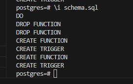
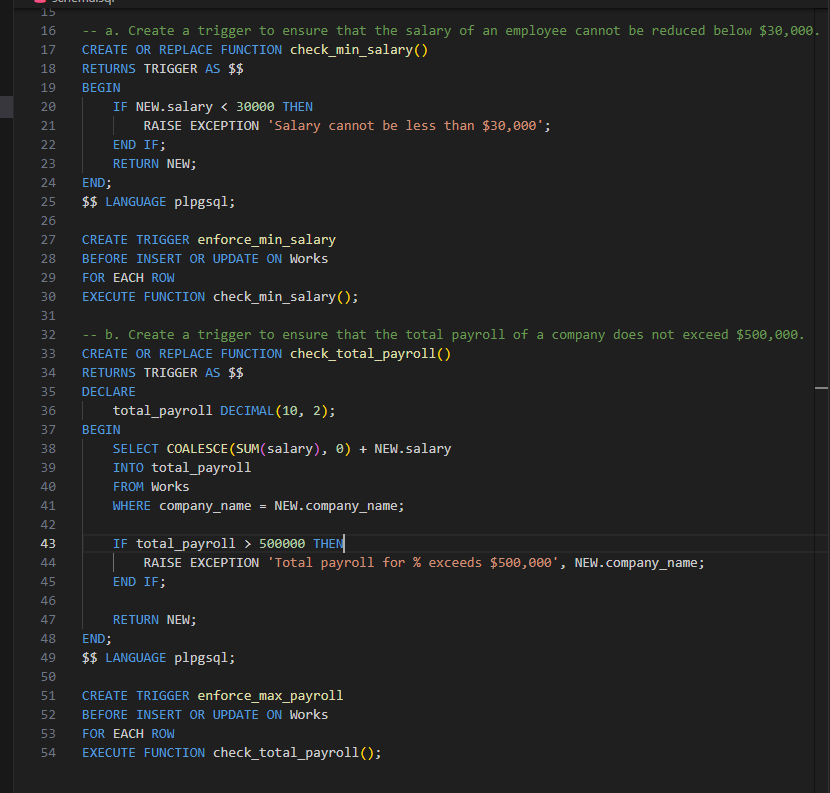

# DSC_E3.18

a. Create a trigger to ensure that the salary of an employee cannot be reduced below $30,000.

b. Create a trigger to ensure that the total payroll of a company does not exceed $500,000.

